# <center><h1 align="center"> Shakti  </h1></center>
### <center><p align="center"><i>A women empowerment app</i></p></center>

<br> 

## Table of Contents

1. [Problem Statement](#problem-statement)
2. [About the project](#about-the-project)
   - [UN 17 Goals](#un-17-goals)
   - [Salient features](#salient-features)
3. [Technology Stack](#technology-stack)
4. [Compatibility](#compatibility)
5. [Tour through the App](#tour-through-the-app)
6. [Flow of the app](#flow-of-the-app)
7. [Implementation of Agile Methodology](#implementation-of-agile-methodology)
8. [Installation](#installation)
9. [Special Instructions to Work with the App](#special-instructions-to-work-with-the-app)
10. [Challenges Faced](#challenges-faced)
11. [Future Scope](#future-scope)
12. [Support and Contact](#future-scope)

## Problem Statement
    
 - We come from an only women's college and feel that there was a lot that we faced to come where we are today.
                                          
 - Looking around and taking surveys we realized that indeed, the entire women community faces a common set of challenges which include not having communities of like minded people, abstaining from talking on taboo topics, scaling small businesses and access to right resources. 
                                          
 - Additionally, there is no one stop solution for us women. Thereby, we came up with the idea of SHAKTI, an app for women of all age groups, from those young girls to us to all the mothers out there!
   
[(Back to the top)](#-shakti--)

## About the project

- The project Shakti is an ***Android Mobile Application built using Flutter*** for Google Developer Solution Challenge 2023 by implementing the Agile Methodology.

- The purpose of the app is to empower women physically, mentally and financially.

- The app uses many Google Technologies like Flutter, Firebase, Tensorflow Lite model tflite for Face Recognition, Dialogflow for Chatbot and Google Maps for location.

[(Back to the top)](#-shakti--)

### UN 17 Goals 

<p align="center">
<span>

</span>
 </p>

- Our target is to achieve gender equality and empower all women and girls. 
- When we analysed the results of our survey, we found that the major problem of women center about lack of awareness and opportunities to discover their real self and perform their best in the society. 
- Due to increased gender inequality, women continue to be underrepresented at all levels. There is a much need to empower women physically, mentally as well as financially.
- In some countries, girls are refrained to talk about taboo topics and thus have limited information. Specially in rural areas, basic topics like menstraution, puberty, health problems are not even discussed. Also the working women, loses track of menstraul cycle amidst responsibilities.
- Women are restricted to go out even for work because of safety concerns. The married women are not even allowed to step out in the market to expand their business of homemade pickle, embroidery, etc. 
- Women sometimes feel uncomfortable in discussing things with thier known ones and are not able to discover the undelying problems. Thus, they need a women community where they can share their feelings and personal experience. 
- Disadvantages in education translate into lack of access to skills and limited opportunities in the labour market. 
<br />
Through our android application, we target to promote empowerment of women by the use of technology.

- The self care feature aware women about the topics which are not generally discussed very freely in some houses. The feature also provide a product section which redirects the user if they want to buy them. The menstrual track remembers the last date and predicts the next dates according to user's cycle for them to plan their travel, work etc.
- The application provide women user with their current location and nearby locations to feel safe and comfortable along with a safety call which sends an SOS on a mobile shake
- The local business run by many housewives and old women can be easily accessed through the store where they can sell their product and buy other's products.
- Women feel a sense of support and share things anonymously with other women and can be a part of the communities according to their interests.
- The application also try to bridge the gap in education by providing women users with video tutorials on specific sections and various opportunities and scholarships in the world out there that they could apply to.

### Salient Features

#### Features to empower physically
- Period Tracker: No more keeping track of your last period, explore the world and take up challenges like a free bird
- Self Care: Feeling shy to talk about those taboo topics you never found it easy to interact with even your closed ones!
- Location: Access your current location and nearby places like hospital, police station etc.
- Safety Call: Contact trusted people in emergency with a phone shake

#### Features to empower mentally
- Groups or Community: A safe platform for women to share feelings and chat anonmously
- Chat Support: Resolve general issues with a chat bot made using Google Dialogflow
- Education: Learn and explore with the tutorials available

#### Features to empower financially
- Store: Manage Business and Home together, buy other's products and sell yours

#### Other features:
- Authentication: A tflite model is used to recognize females and only allow women user to sign in
- Opportunities: Get acccess to various opportunities, scholarships and schemes just at a click! 
- Organizations: Non-profit organizations to reach out for help

[(Back to the top)](#-shakti--)

## Technology Stack

<p align="center">
<span>


</span>
 </p>

- Flutter and Dart were used to develop the application.
- Necessary packages were imported from pub.dev.
- The backend has been implemented using Firebase. (Firebase authentication, Firestore and Firebase Storage have been used).
- The models for Face Recognition have been implemented using tflite.
- The locations have been fetched using Google Maps.
- Google DialogFlow is used for implementing chat bot support.

[(Back to the top)](#-shakti--)


## Compatibility

The flutter application is compatible to run on android smart phones.

[(Back to the top)](#-shakti--)


## Tour through the App
- <h3> Initial Screens: Login and Sign up</h3>
<p align="left">
  <figure>
  <kbd>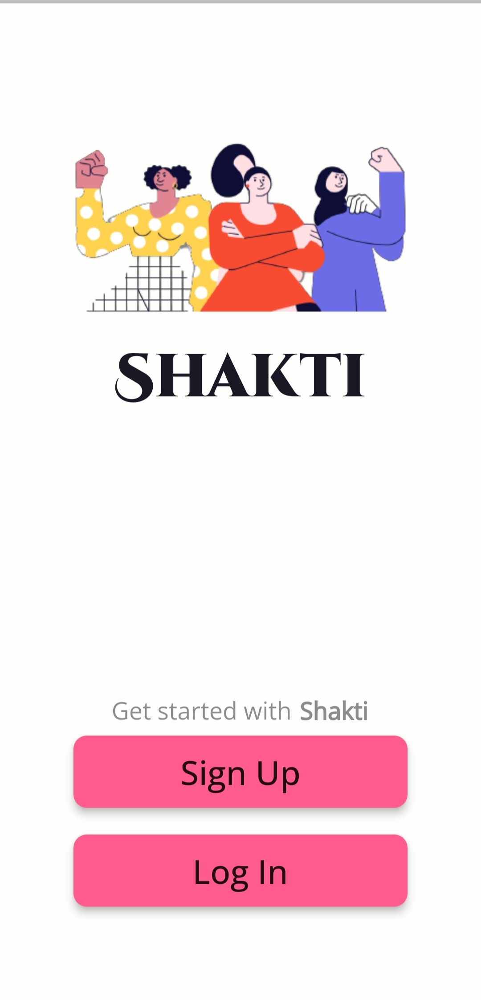
   <div><figcaption> <p align="center" style="font-size:100px"> Welcome Screen</p></figcaption></div>
     </figure>&nbsp;&nbsp;&nbsp;&nbsp;&nbsp;&nbsp;
   <figure>
  <kbd>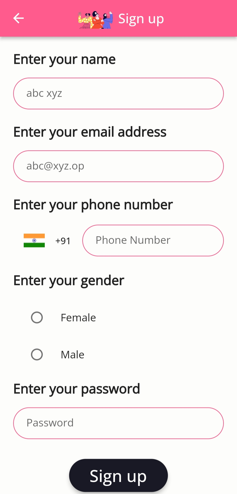
   <div><figcaption> <p align="center" style="font-size:100px"> Sign Up Screen</p></figcaption></div>
     </figure>&nbsp;&nbsp;&nbsp;&nbsp;&nbsp;&nbsp;
    <figure>
  <kbd>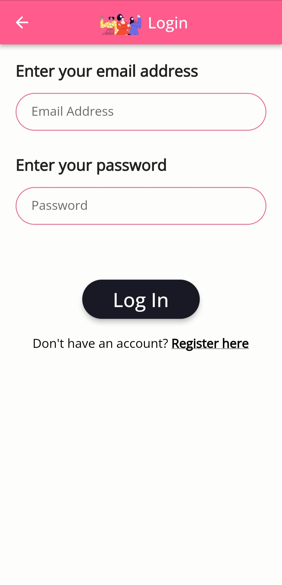
   <div><figcaption> <p align="center" style="font-size:100px"> Login In Screen</p></figcaption></div>
     </figure>&nbsp;&nbsp;&nbsp;&nbsp;&nbsp;&nbsp;
</p>
<hr>
      
- <h3> Screens displaying features that empower women physically:</h3>
<p align="left">
   <figure style="padding-right: 20px;" >
  <kbd>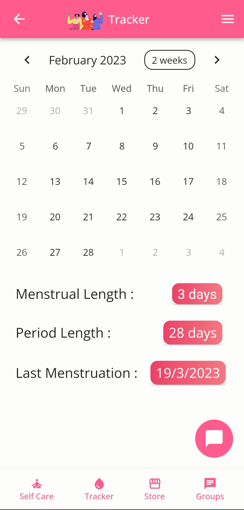
   <div><figcaption> <p align="center" style="font-size:100px">Period Tracker</p></figcaption></div>
     </figure>&nbsp;&nbsp;&nbsp;&nbsp;&nbsp;&nbsp;
  <figure>
  <kbd>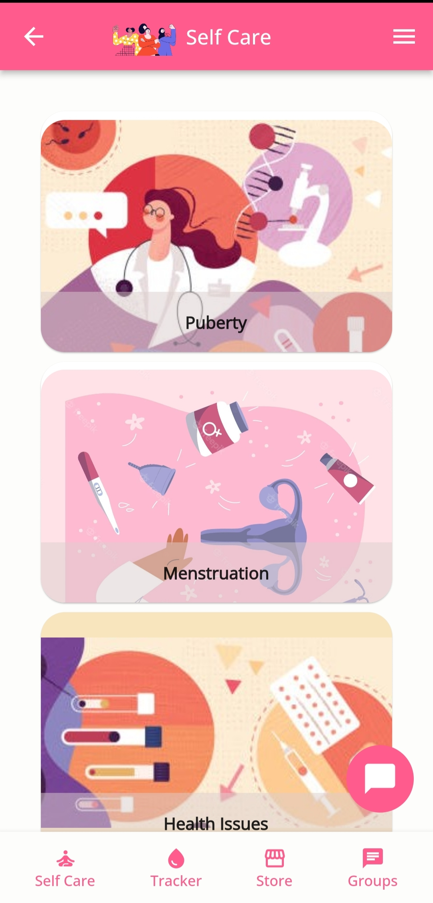
   <div><figcaption> <p align="center" style="font-size:100px">Self care</p></figcaption></div>
     </figure>&nbsp;&nbsp;&nbsp;&nbsp;&nbsp;&nbsp;
   <figure>
  <kbd>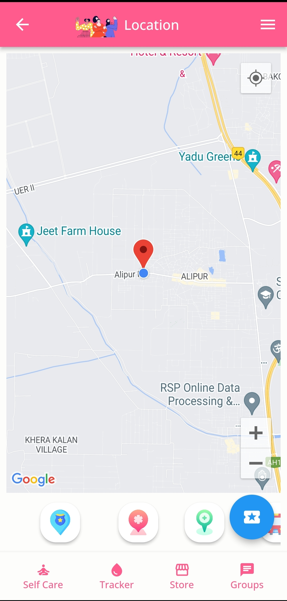
   <div><figcaption> <p align="center" style="font-size:100px"> Location</p></figcaption></div>
     </figure>&nbsp;&nbsp;&nbsp;&nbsp;&nbsp;&nbsp;
    <figure>
  <kbd>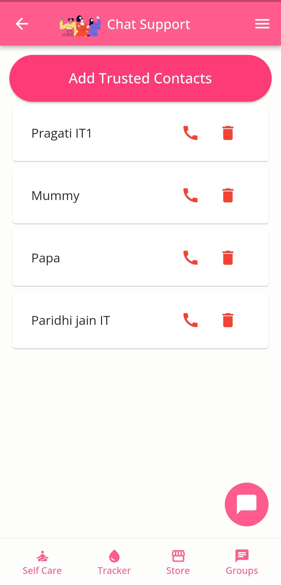
   <div><figcaption> <p align="center" style="font-size:100px"> Safety Call</p></figcaption></div>
     </figure>
 </p>    

<hr>
      
- <h3> Screens displaying features that empower women mentally:</h3>
<p align="left">
   <figure style="padding-right: 20px;" >
  <kbd>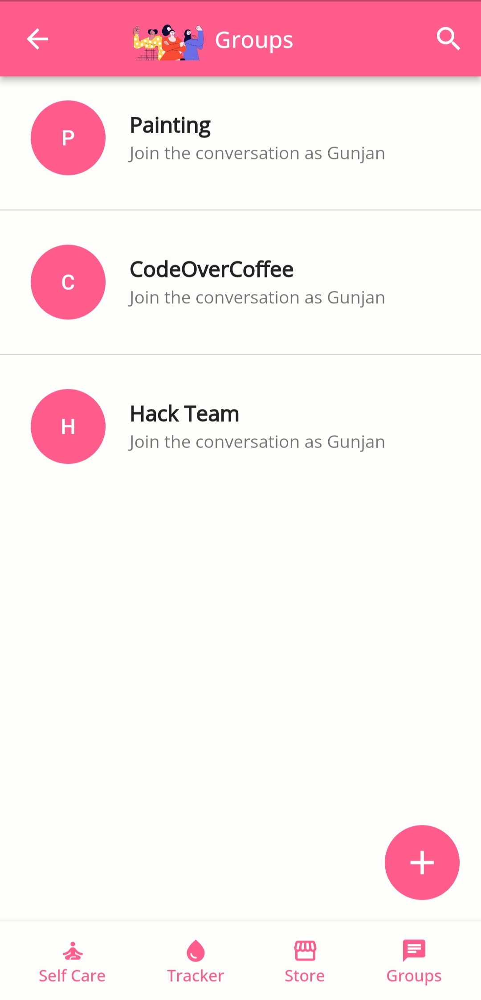
   <div><figcaption> <p align="center" style="font-size:100px">Groups or community</p></figcaption></div>
     </figure>&nbsp;&nbsp;&nbsp;&nbsp;&nbsp;&nbsp;
  <figure>
  <kbd>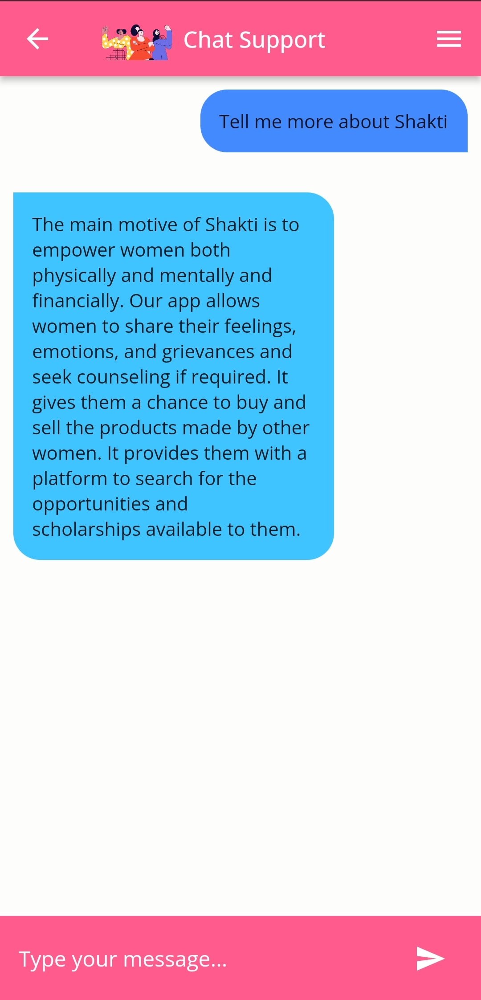
   <div><figcaption> <p align="center" style="font-size:100px">Chat Support</p></figcaption></div>
     </figure>&nbsp;&nbsp;&nbsp;&nbsp;&nbsp;&nbsp;
   <figure>
  <kbd>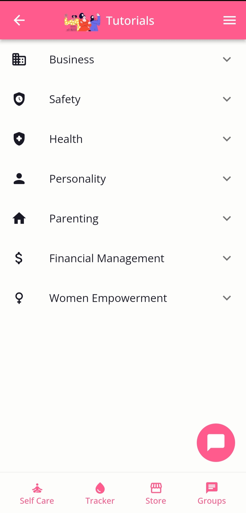
   <div><figcaption> <p align="center" style="font-size:100px"> Education</p></figcaption></div>
     </figure>&nbsp;&nbsp;&nbsp;&nbsp;&nbsp;&nbsp;
    <figure>
 </p>    

<hr>
 
- <h3> Screens displaying features that empower women financially:</h3>
<p align="left">
   <figure style="padding-right: 20px;" >
  <kbd>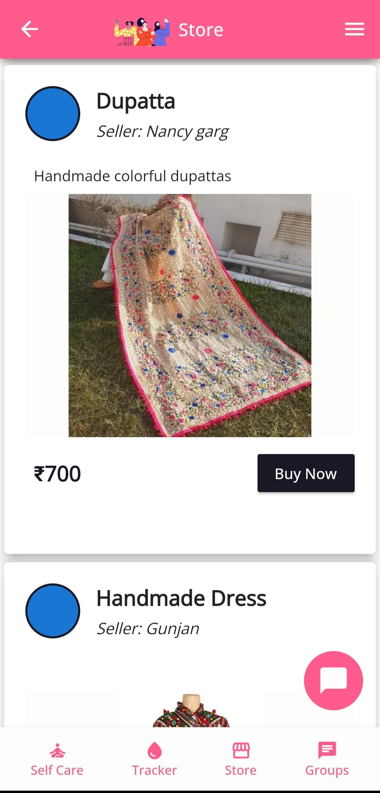
   <div><figcaption> <p align="center" style="font-size:100px">Store</p></figcaption></div>
     </figure>&nbsp;&nbsp;&nbsp;&nbsp;&nbsp;&nbsp;
  <figure>
  <kbd>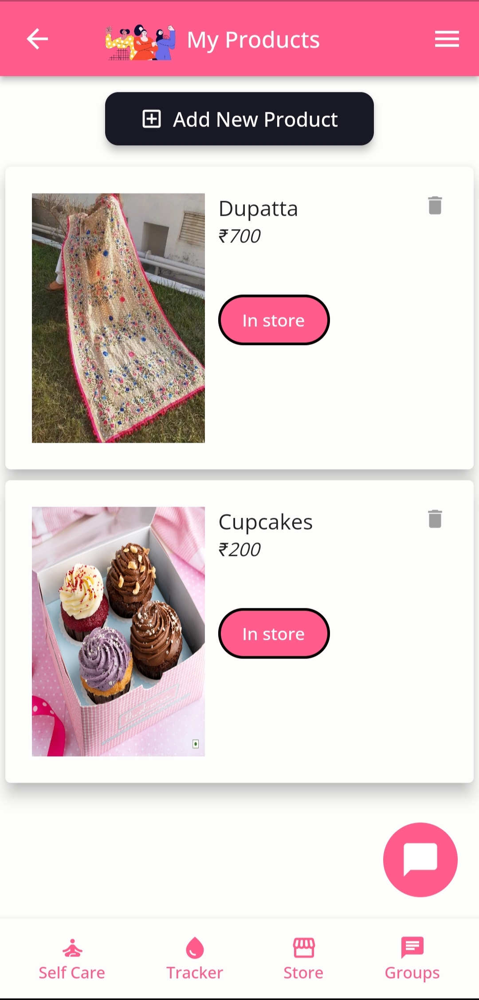
   <div><figcaption> <p align="center" style="font-size:100px">MyProducts</p></figcaption></div>
     </figure>&nbsp;&nbsp;&nbsp;&nbsp;&nbsp;&nbsp;
   <figure>
   <kbd>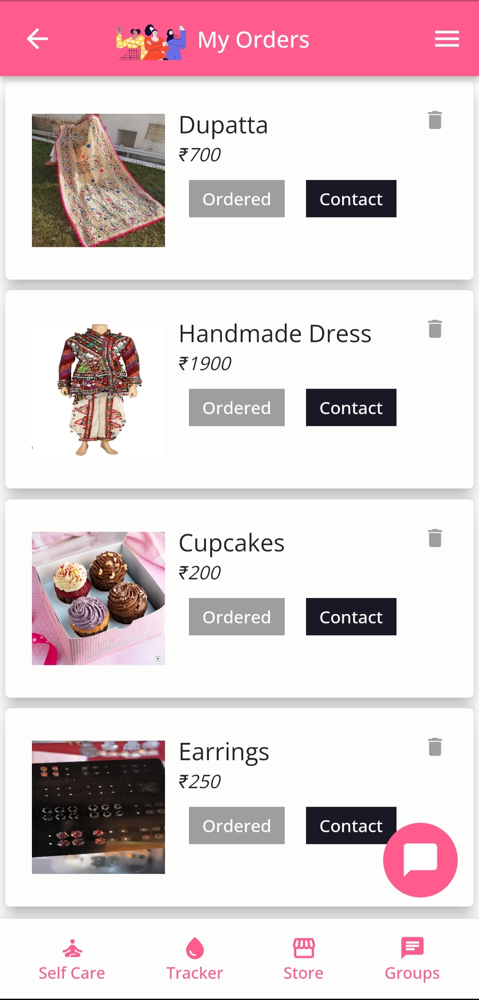
   <div><figcaption> <p align="center" style="font-size:100px">MyOrders</p></figcaption></div>
     </figure>&nbsp;&nbsp;&nbsp;&nbsp;&nbsp;&nbsp;
   <figure>
 </p>    

<hr>
 
- <h3> Other: </h3>
<p align="left">
   <figure style="padding-right: 20px;" >
  <kbd>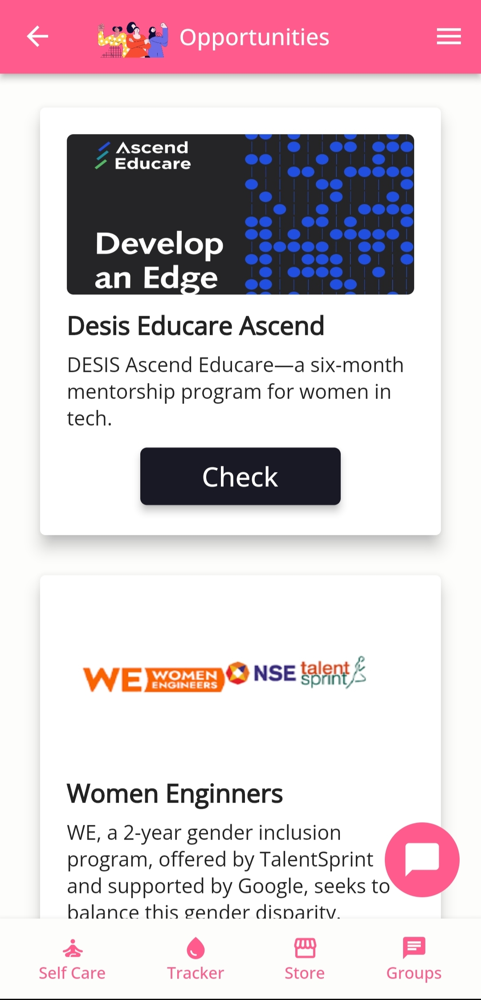
   <div><figcaption> <p align="center" style="font-size:100px">Opportunities</p></figcaption></div>
     </figure>&nbsp;&nbsp;&nbsp;&nbsp;&nbsp;&nbsp;
  <figure>
  <kbd>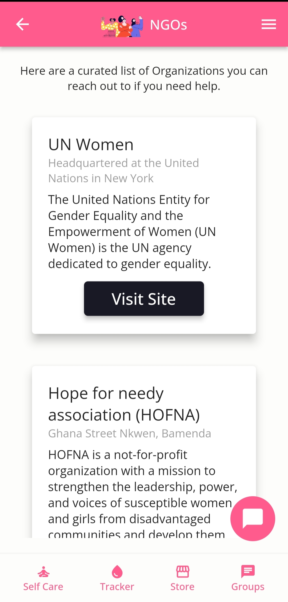
   <div><figcaption> <p align="center" style="font-size:100px">Organizations</p></figcaption></div>
     </figure>&nbsp;&nbsp;&nbsp;&nbsp;&nbsp;&nbsp;
   <figure>
 </p>    

<hr>
      
[(Back to the top)](#-shakti--)
    
    
## Flow of the App
<p align="center"></p>

[(Back to the top)](#-shakti--)
    
    
## Implementation of Agile Methodology

### What is Agile?
Agile is a development methodology adopted today in the software industry. Agile promotes teamwork, flexible procedures, and sle-organizing teams.

### How we incorporated Agile Methodology during the development cycle?
SCRUM is a subset of Agile, a framework for developing software.The basic time working unit is the sprint. SCRUM teams always reason in sprints and their planning is limited to sprints.

- Sprint 1: **Research and Design**
- Sprint 2: **Building the application**
- Sprint 3: **Testing and debugging** 
     
    
### How it helped us?

- It made the app development process more efficient and predictable.
- We worked on functionalities looking at them as smaller units of the larger app due to which the process was easy to handle, flexible and allowed more room to adjust new functionalities.

[(Back to the top)](#-shakti--)
    

## Installation

Initialise git on your terminal:
```
git init
```
<br>

Clone this repository:
``` 
git clone https://github.com/FlutterFiesta/Shakti.git
```
<br>

Change the directory.
```
cd Shakti/
```
      
<br>
      
      
Run the ```packages get``` command in your project directory:

```
flutter pub get
```

<br>

Once the build is complete, run the ```run``` command to start the app:

```
flutter run
```

In case you encounter the error ```A problem occurred evaluating project ':tflite'```,

you should change this on ~\tflite-1.1.2\android\build.gradle:

```
dependencies {
    compile 'org.tensorflow:tensorflow-lite:+'
    compile 'org.tensorflow:tensorflow-lite-gpu:+'
}
```
to this:
```
dependencies {
    implementation 'org.tensorflow:tensorflow-lite:+'
    implementation 'org.tensorflow:tensorflow-lite-gpu:+'
} 
```

[(Back to the top)](#-shakti--)
    
## Special Instructions to Work with the App

1. The application can only be run on android physical devices. Due to the app being heavy, it would not work on virtual emulators.

2. Depending on the kind of predictions made by the models, different alerts are prompted. The app allows to proceed when it is confirmed that it is the image of a female after careful examination.

3. In case the app prompts to upload a clear image of a female, please ensure proper lighting in the image.

4. Male users are prompted while selecting the gender and also would not be verified during face recognition.

5. Permission to use Camera, Location, Contacts, Messaging etc should be given whenever prompted.

[(Back to the top)](#-shakti--)

## Challenges Faced
1. The major challenge was recognizing and matching the faces of women only. Though, there are a lot a APIs that support human face recognition, none of them clearly mentions about gender face recognition.
   - *Therefore, we decided to implement tflite models inorder to predict the women.*
2. We've taken a survey about the common problems of women nearby, there were many things that need to be catered to but choosing some of them was a challenge for us. Moreover, we don't have suitable technologies for implementing some of the solutions.
3. The features decided to serve as small applications in themselves- grouping together would be a major task by selecting the appropriate technology.
4. The flutter depreciations, the amount of load an application takes, and updations in firebase were also taken into consideration.
5. The live location was not being fetched, then we changed the permissions for the same that could use GPS in android.
6. Another challenge was to select UI theme as it should be appealing to attract women users to the app. It should reflect feeling of being at peace, safe, strong, and empowered. Women users should feel comfortable while using the app.

[(Back to the top)](#-shakti--)
    
## Future Scope
- Period Tracker: Taking into consideration several factors that might lead to irregularity would result in a better prediction
- Self Care: ChatGPT API could be integrated to answer all other questions related to taboo topics instantly
- Location: Search path between two routes can be implemented using Google Maps API
- Safety Call: Call is sent to all the trusted contacts along with message so that they can notice it even when they don't check their phone
- Community: Moderator for the avoidance of hate and negativity
- Chat Support: Implement monetary discussions with counsellors and doctors and multi-language feature
- Education: Upgrade the content with progress levels to encourage women by awarding them with points 
- Store: Can integrate payment gateway and also allow males to access this section of the app to buy and sell products
- Authentication: Implement a three layer auth: One more layer using aadhar card gender verification, which could either be an uploaded image or scanner feature or using gestures and movements to verify
- Opportunities: Include the opportunities for both men and women 

[(Back to the top)](#-shakti--)
    
## Support and Contact

Email to: codeoverc23@gmail.com    
    
[(Back to the top)](#-shakti--)
